# Алгоритмы тренировка

## Задача: реализовать очередь и стек на массивах и на списках и сравнить скорость работы.

Необходимо реализовать функции добавления и извлечения элемента. Представим абстракции стека и очереди как структур данных:

## Решение

Вашему вниманию предлагается графическое представление задачи:

| абстракция | детали обстракции |
| ----- | ----- |
| 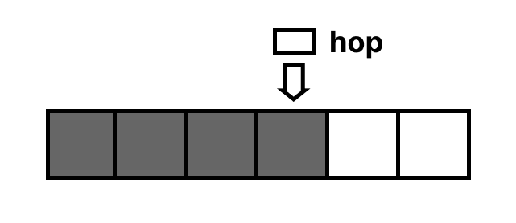 | hop - указатель на последний добавленный элемент |
|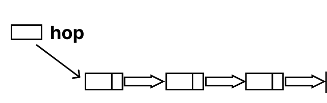| hop - указатель на последний добавленный элемент |
| | first - указатель на первый вошедший в очередь элемент, last - указатель на последний вошедший элемент |
| | first - указатель на первый вошедший в очередь элемент, last - указатель на последний вошедший элемент |

## Пограничные случаи

Рассмотрим пограничные случаи для каждого из представленных выше абстракций

| абстракция | картинка | пограничные случаи на добавление и удаление элементов |
|-------------|--------|---------------------|
|Стек на массивах |  | <ol> <li>В стеке нет элементов. **Проблема добавления:** указатель hop указывает в пустоту. **Проблема извлечения:** нечего извлекать из пустоты. </li> <li> Массив заполнен полностью. **Проблема добавления:** нет места для добавления. |
| Стек на списках |  | --- |
| Очередь на массивах |  | <ol> <li> В очереди нет элементов. **Проблема добавления:** указатель first указывает в пустоту. **Проблема извлечения:** нечего извлекать из пустоты. |
| Очередь на списках |  | --- |

## Реализация на языке С++

Реализовано с помощью структур

| структура данных | поля структуры | функция добавления | функция извлечения |
|------|-----|------|----|
| стек на массивах | 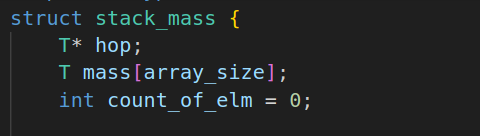 | 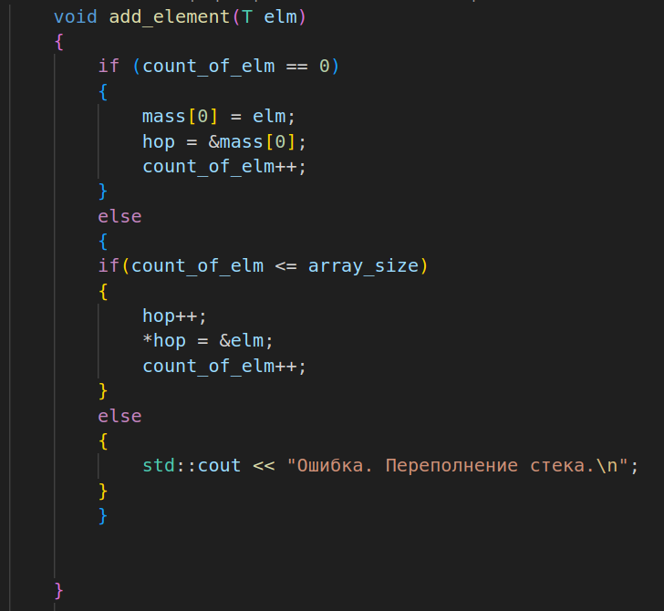 | 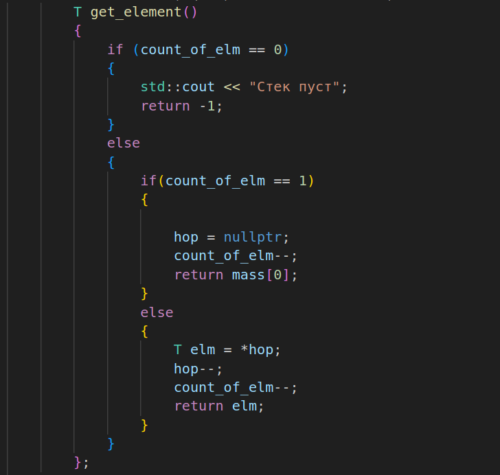 |
| стек на списках  | 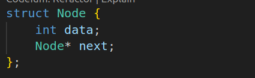 | 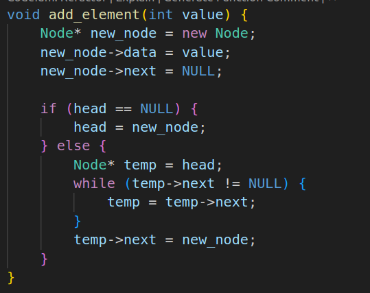 | 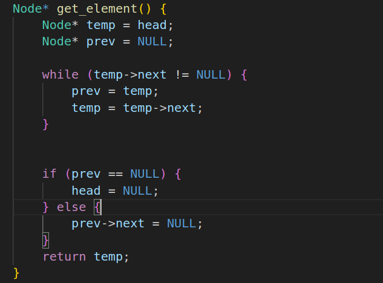 |
| очередь на списках|  | 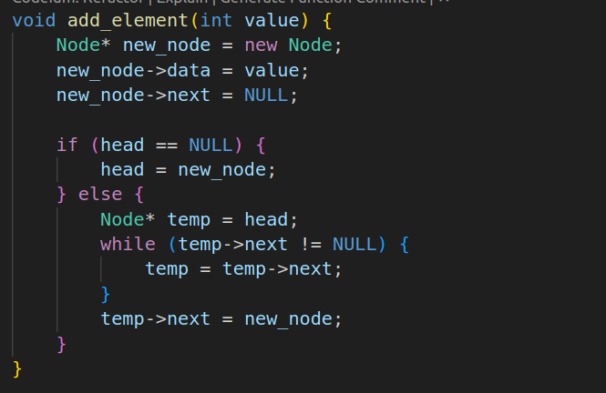 | 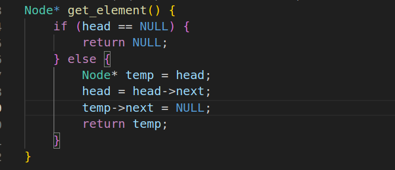 |
| очередь на массивах |  | 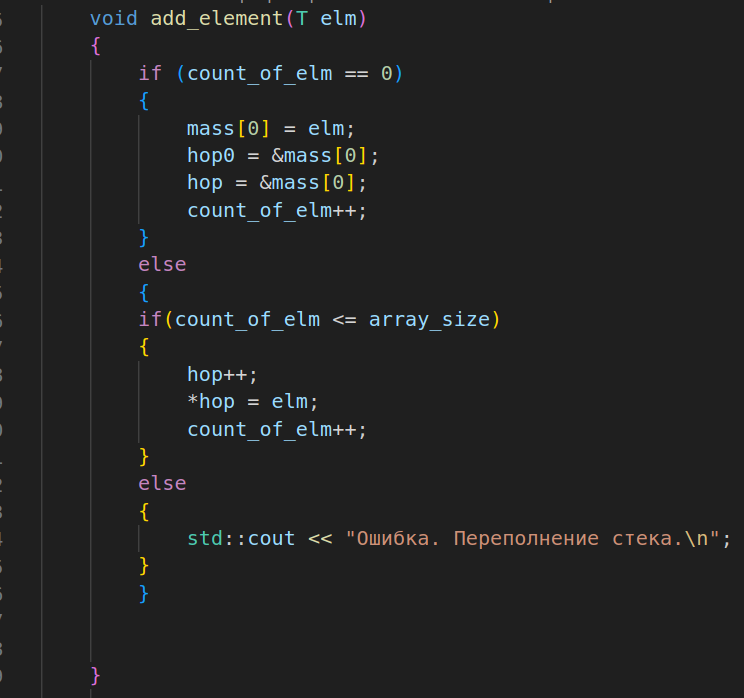 | 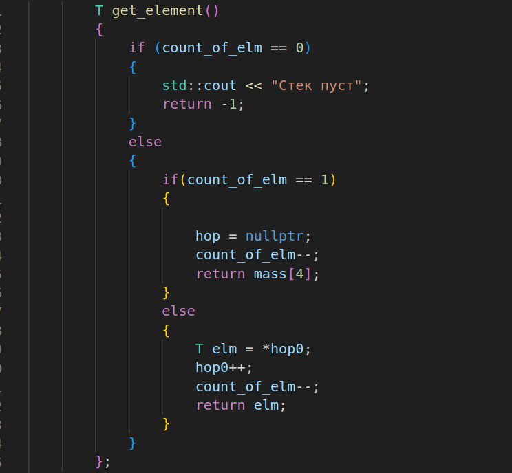 |

